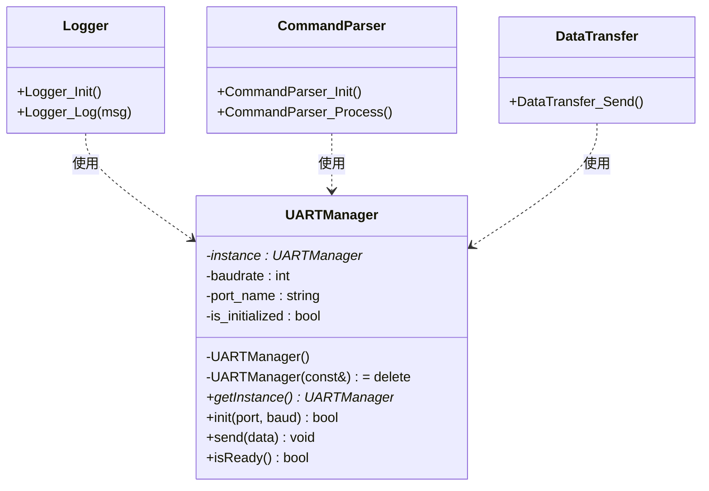

# 01. 单例模式 - 类图详解

## 类图



---

## 字段详解

### UARTManager（UART 管理器 - 单例类）

| 字段/方法 | 类型 | 说明 |
|-----------|------|------|
| `-instance` | `UARTManager*` | **静态单例实例**，全局唯一的 UARTManager 对象指针 |
| `-baudrate` | `int` | **波特率**，UART 通信速率（如 115200, 9600） |
| `-port_name` | `string` | **端口名称**，如 "UART1", "/dev/ttyUSB0" |
| `-is_initialized` | `bool` | **初始化标志**，true 表示已初始化 |
| `-UARTManager()` | 构造函数 | **私有构造**，防止外部创建实例 |
| `-UARTManager(const&) = delete` | 拷贝构造 | **删除拷贝**，防止拷贝创建新实例 |
| `+getInstance()` | `UARTManager*` | **全局访问点**，获取唯一实例（第一次调用时创建） |
| `+init(port, baud)` | `bool` | **初始化 UART**，只能调用一次，重复调用返回 false |
| `+send(data)` | `void` | **发送数据**，通过 UART 发送字符串 |
| `+isReady()` | `bool` | **检查状态**，返回是否已初始化 |

### Logger（日志模块 - 客户端）

| 方法 | 说明 |
|------|------|
| `+Logger_Init()` | 初始化日志系统，设置波特率 115200 |
| `+Logger_Log(msg)` | 发送日志消息 |

### CommandParser（命令解析模块 - 客户端）

| 方法 | 说明 |
|------|------|
| `+CommandParser_Init()` | 初始化命令解析器，尝试初始化 UART（会被阻止） |
| `+CommandParser_Process()` | 处理命令 |

### DataTransfer（数据传输模块 - 客户端）

| 方法 | 说明 |
|------|------|
| `+DataTransfer_Send()` | 发送数据包 |

---

## 单例模式三要素

```
1. 私有构造函数 → 防止外部 new
2. 静态唯一实例 → 保存全局唯一对象
3. 全局访问点 → getInstance() 提供统一入口
```

---

## 代码示例

```cpp
// 场景 1：日志系统初始化
Logger_Init();
// 调用：UARTManager::getInstance()->init("UART1", 115200)
// 结果：UART 初始化成功

// 场景 2：命令解析器尝试初始化
CommandParser_Init();
// 调用：UARTManager::getInstance()->init("UART1", 9600)
// 结果：UART 已初始化，返回 false（阻止重复初始化）

// 场景 3：验证实例唯一性
UARTManager* uart1 = UARTManager::getInstance();
UARTManager* uart2 = UARTManager::getInstance();
// uart1 == uart2 → true（同一个实例）
```

---

## 查看方法

1. 安装插件：**Markdown Preview Mermaid Support**
2. 按 `Ctrl+Shift+V` 预览
