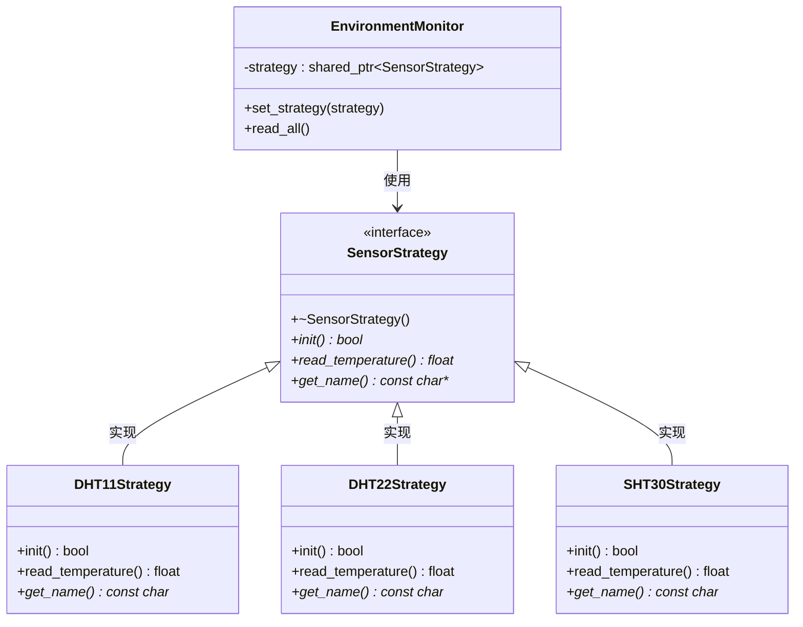

# 02. 策略模式 - 类图详解

## 类图



---

## 字段详解

### SensorStrategy（传感器策略 - 接口）

| 字段/方法 | 类型 | 说明 |
|-----------|------|------|
| `+~SensorStrategy()` | 虚析构 | **虚析构函数**，确保派生类正确析构 |
| `+init()*` | `bool` | **初始化传感器**，各传感器实现不同的初始化流程 |
| `+read_temperature()*` | `float` | **读取温度**，返回温度值（°C） |
| `+get_name()*` | `const char*` | **获取名称**，返回传感器名称字符串 |

### DHT11Strategy（DHT11 策略 - 具体策略）

| 方法 | 说明 |
|------|------|
| `+init()` | 初始化单总线 GPIO，发送启动信号 |
| `+read_temperature()` | 读取 40bit 数据，返回温度 = 原始值/10 |
| `+get_name()` | 返回 "DHT11 (低成本)" |

### DHT22Strategy（DHT22 策略 - 具体策略）

| 方法 | 说明 |
|------|------|
| `+init()` | 初始化单总线（高精度模式） |
| `+read_temperature()` | 精度±0.5°C，温度范围 -40~80°C |
| `+get_name()` | 返回 "DHT22 (高精度)" |

### SHT30Strategy（SHT30 策略 - 具体策略）

| 方法 | 说明 |
|------|------|
| `+init()` | 初始化 I2C 总线，检测设备地址 0x44 |
| `+read_temperature()` | I2C 读取，精度±0.3°C |
| `+get_name()` | 返回 "SHT30 (工业级)" |

### EnvironmentMonitor（环境监控器 - 上下文）

| 字段/方法 | 类型 | 说明 |
|-----------|------|------|
| `-strategy` | `shared_ptr~SensorStrategy~` | **当前策略**，智能指针持有当前传感器策略对象 |
| `+set_strategy(strategy)` | `void` | **切换策略**，设置新的传感器策略 |
| `+read_all()` | `void` | **读取数据**，委托给当前策略执行 |

---

## 策略模式核心

```
1. 定义策略接口 → SensorStrategy
2. 实现多个具体策略 → DHT11/DHT22/SHT30
3. 上下文持有策略 → EnvironmentMonitor
4. 运行时切换策略 → set_strategy()
```

---

## 代码示例

```cpp
// 创建监控器
EnvironmentMonitor monitor;

// 场景 1：使用 DHT11（低成本方案）
monitor.set_strategy(make_shared<DHT11Strategy>());
monitor.read_all();  // 读取温度

// 场景 2：切换到 DHT22（需要高精度）
monitor.set_strategy(make_shared<DHT22Strategy>());
monitor.read_all();

// 场景 3：切换到 SHT30（工业级应用）
monitor.set_strategy(make_shared<SHT30Strategy>());
monitor.read_all();
```

---

## 查看方法

1. 安装插件：**Markdown Preview Mermaid Support**
2. 按 `Ctrl+Shift+V` 预览
