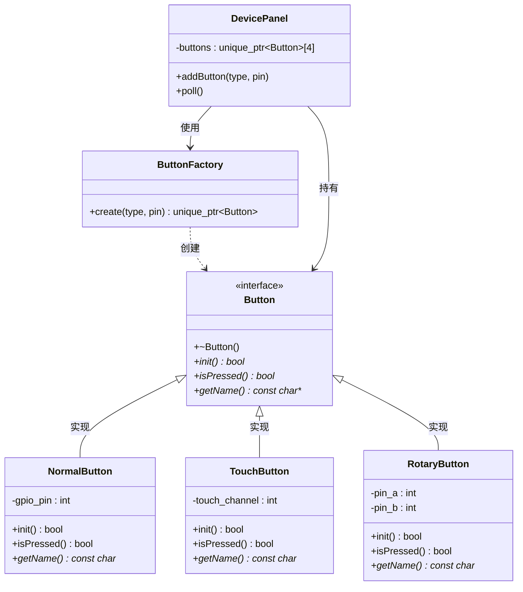

# 03. 工厂模式 - 类图详解

## 类图



---

## 字段详解

### Button（按键 - 产品接口）

| 字段/方法 | 类型 | 说明 |
|-----------|------|------|
| `+~Button()` | 虚析构 | **虚析构函数**，确保派生类正确析构 |
| `+init()*` | `bool` | **初始化按键**，配置 GPIO 或触摸通道 |
| `+isPressed()*` | `bool` | **检测按键**，返回是否被按下 |
| `+getName()*` | `const char*` | **获取名称**，返回按键类型名称 |

### NormalButton（普通按键 - 具体产品）

| 字段/方法 | 类型 | 说明 |
|-----------|------|------|
| `-gpio_pin` | `int` | **GPIO 引脚号**，如 10, 11 |
| `+init()` | `bool` | 初始化 GPIO 为上拉输入模式 |
| `+isPressed()` | `bool` | 读取 GPIO 电平判断是否按下 |
| `+getName()` | `const char*` | 返回 "普通按键" |

### TouchButton（触摸按键 - 具体产品）

| 字段/方法 | 类型 | 说明 |
|-----------|------|------|
| `-touch_channel` | `int` | **触摸通道号**，如 3, 4 |
| `+init()` | `bool` | 初始化触摸传感器通道 |
| `+isPressed()` | `bool` | 检测电容变化判断是否触摸 |
| `+getName()` | `const char*` | 返回 "触摸按键" |

### RotaryButton（旋钮编码器 - 具体产品）

| 字段/方法 | 类型 | 说明 |
|-----------|------|------|
| `-pin_a` | `int` | **编码器 A 相引脚** |
| `-pin_b` | `int` | **编码器 B 相引脚** |
| `+init()` | `bool` | 初始化两个 GPIO 引脚 |
| `+isPressed()` | `bool` | 检测旋钮按下开关 |
| `+getName()` | `const char*` | 返回 "旋钮编码器" |

### ButtonFactory（按键工厂）

| 方法 | 说明 |
|------|------|
| `+create(type, pin)` | 根据类型参数创建对应的按键对象，返回 `unique_ptr~Button~` |

### DevicePanel（设备面板 - 客户端）

| 字段/方法 | 类型 | 说明 |
|-----------|------|------|
| `-buttons` | `unique_ptr~Button~[4]` | **按键数组**，最多 4 个按键 |
| `+addButton(type, pin)` | `void` | **添加按键**，通过工厂创建并添加到数组 |
| `+poll()` | `void` | **轮询所有按键**，检测按键状态 |

---

## 简单工厂模式核心

```
1. 一个工厂类处理所有创建
2. 客户端只传类型参数
3. 工厂返回统一接口指针
```

---

## 代码示例

```cpp
// 创建设备面板
DevicePanel panel;

// 添加普通按键（GPIO 10）
panel.addButton(ButtonFactory::Type::NORMAL, 10);

// 添加触摸按键（通道 3）
panel.addButton(ButtonFactory::Type::TOUCH, 3);

// 添加旋钮按键（引脚 5, 6）
panel.addButton(ButtonFactory::Type::ROTARY, 5);

// 轮询所有按键
panel.poll();
```

---

## 查看方法

1. 安装插件：**Markdown Preview Mermaid Support**
2. 按 `Ctrl+Shift+V` 预览
