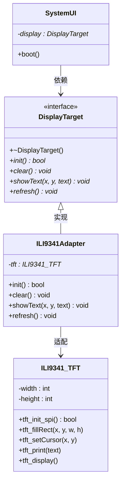

# 04. 适配器模式 - 类图详解

## 类图



---

## 字段详解

### DisplayTarget（显示目标 - 目标接口）

| 字段/方法 | 类型 | 说明 |
|-----------|------|------|
| `+~DisplayTarget()` | 虚析构 | **虚析构函数** |
| `+init()*` | `bool` | **初始化显示屏** |
| `+clear()*` | `void` | **清屏** |
| `+showText(x, y, text)*` | `void` | **显示文本**，在指定坐标显示字符串 |
| `+refresh()*` | `void` | **刷新显示**，更新屏幕 |

### ILI9341_TFT（TFT 屏幕 - 被适配者）

| 字段/方法 | 类型 | 说明 |
|-----------|------|------|
| `-width` | `int` | **屏幕宽度**，如 320 像素 |
| `-height` | `int` | **屏幕高度**，如 240 像素 |
| `+tft_init_spi()` | `bool` | **初始化 SPI 接口**，配置 TFT 的 SPI 通信 |
| `+tft_fillRect(x, y, w, h)` | `void` | **填充矩形**，在指定区域填充颜色 |
| `+tft_setCursor(x, y)` | `void` | **设置光标位置** |
| `+tft_print(text)` | `void` | **打印文本**，在光标处显示 |
| `+tft_display()` | `void` | **刷新显示缓冲区** |

### ILI9341Adapter（TFT 适配器 - 适配器）

| 字段/方法 | 类型 | 说明 |
|-----------|------|------|
| `-tft` | `ILI9341_TFT*` | **持有被适配对象**，TFT 屏幕指针 |
| `+init()` | `bool` | **转换调用** `tft->tft_init_spi()` |
| `+clear()` | `void` | **转换调用** `tft->tft_fillRect(0,0,320,240,0)` 填充黑色 |
| `+showText(x, y, text)` | `void` | **转换调用** `tft->tft_setCursor(x,y)` + `tft->tft_print(text)` |
| `+refresh()` | `void` | **转换调用** `tft->tft_display()` |

### SystemUI（系统界面 - 客户端）

| 字段/方法 | 类型 | 说明 |
|-----------|------|------|
| `-display` | `DisplayTarget*` | **显示接口指针**，可以是 OLED 或适配后的 TFT |
| `+boot()` | `void` | **启动界面**，显示启动信息 |

---

## 适配器模式核心

```
1. 目标接口：DisplayTarget（系统期望的接口）
2. 被适配者：ILI9341_TFT（新屏幕原有接口）
3. 适配器：ILI9341Adapter（实现目标接口，内部调用 TFT 方法）
4. 客户端：SystemUI（不需要修改代码）
```

---

## 代码示例

```cpp
// 创建适配器（包装 TFT 屏）
ILI9341Adapter adapter(320, 240);

// 创建系统 UI（使用原有代码，不需要修改）
SystemUI ui(&adapter);

// 启动界面
ui.boot();
// 内部调用转换：
// ui.display->init() → adapter.init() → tft->tft_init_spi()
```

---

## 查看方法

1. 安装插件：**Markdown Preview Mermaid Support**
2. 按 `Ctrl+Shift+V` 预览
