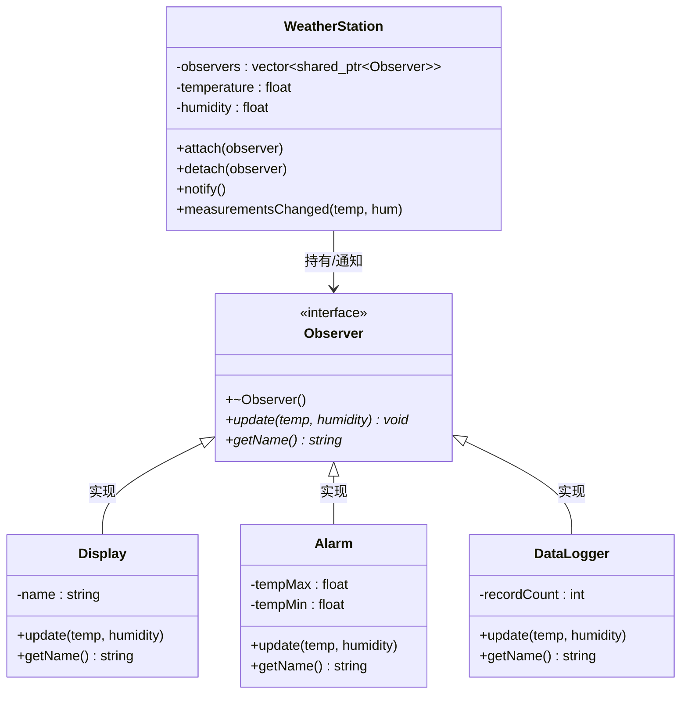

# 05. 观察者模式 - 类图详解

## 类图



---

## 字段详解

### Observer（观察者 - 接口）

| 字段/方法 | 类型 | 说明 |
|-----------|------|------|
| `+~Observer()` | 虚析构 | **虚析构函数** |
| `+update(temp, humidity)*` | `void` | **更新方法**，接收被观察者的通知 |
| `+getName()*` | `string` | **获取名称**，返回观察者名称 |

### WeatherStation（气象站 - 被观察者）

| 字段/方法 | 类型 | 说明 |
|-----------|------|------|
| `-observers` | `vector~shared_ptr~Observer~~` | **观察者列表**，存储所有注册的观察者 |
| `-temperature` | `float` | **当前温度**，最新的温度测量值 |
| `-humidity` | `float` | **当前湿度**，最新的湿度测量值 |
| `+attach(observer)` | `void` | **注册观察者**，添加到 observers 列表 |
| `+detach(observer)` | `void` | **移除观察者**，从 observers 列表删除 |
| `+notify()` | `void` | **通知所有观察者**，遍历调用每个 update() |
| `+measurementsChanged(temp, hum)` | `void` | **测量值变化**，更新数据并通知 |

### Display（显示屏 - 具体观察者）

| 字段/方法 | 类型 | 说明 |
|-----------|------|------|
| `-name` | `string` | **显示屏名称**，如 "LCD 显示屏" |
| `+update(temp, humidity)` | `void` | **更新显示**，在屏幕上显示温湿度 |
| `+getName()` | `string` | 返回名称 |

### Alarm（报警器 - 具体观察者）

| 字段/方法 | 类型 | 说明 |
|-----------|------|------|
| `-tempMax` | `float` | **温度上限**，如 40.0°C，超过则报警 |
| `-tempMin` | `float` | **温度下限**，如 0.0°C，低于则报警 |
| `+update(temp, humidity)` | `void` | **检查报警**，温度超限时发出警报 |
| `+getName()` | `string` | 返回名称 |

### DataLogger（数据日志器 - 具体观察者）

| 字段/方法 | 类型 | 说明 |
|-----------|------|------|
| `-recordCount` | `int` | **记录计数**，已记录的數據条数 |
| `+update(temp, humidity)` | `void` | **记录数据**，保存温湿度到日志 |
| `+getName()` | `string` | 返回名称 |

---

## 观察者模式核心

```
1. 被观察者：WeatherStation（维护观察者列表）
2. 观察者接口：Observer（定义 update 方法）
3. 具体观察者：Display/Alarm/DataLogger
4. 通知机制：measurementsChanged → notify → update
```

---

## 代码示例

```cpp
// 创建气象站
auto station = make_shared<WeatherStation>();

// 创建观察者
auto display = make_shared<Display>("LCD 显示屏");
auto alarm = make_shared<Alarm>(35.0f, 10.0f, "温度报警器");
auto logger = make_shared<DataLogger>("数据日志器");

// 注册观察者
station->attach(display);
station->attach(alarm);
station->attach(logger);

// 数据变化时自动通知所有观察者
station->measurementsChanged(25.0f, 60.0f);
// 内部流程：
// 1. 更新 temperature=25.0, humidity=60.0
// 2. 调用 notify()
// 3. 遍历 observers，调用每个 update(25.0, 60.0)
```

---

## 查看方法

1. 安装插件：**Markdown Preview Mermaid Support**
2. 按 `Ctrl+Shift+V` 预览
