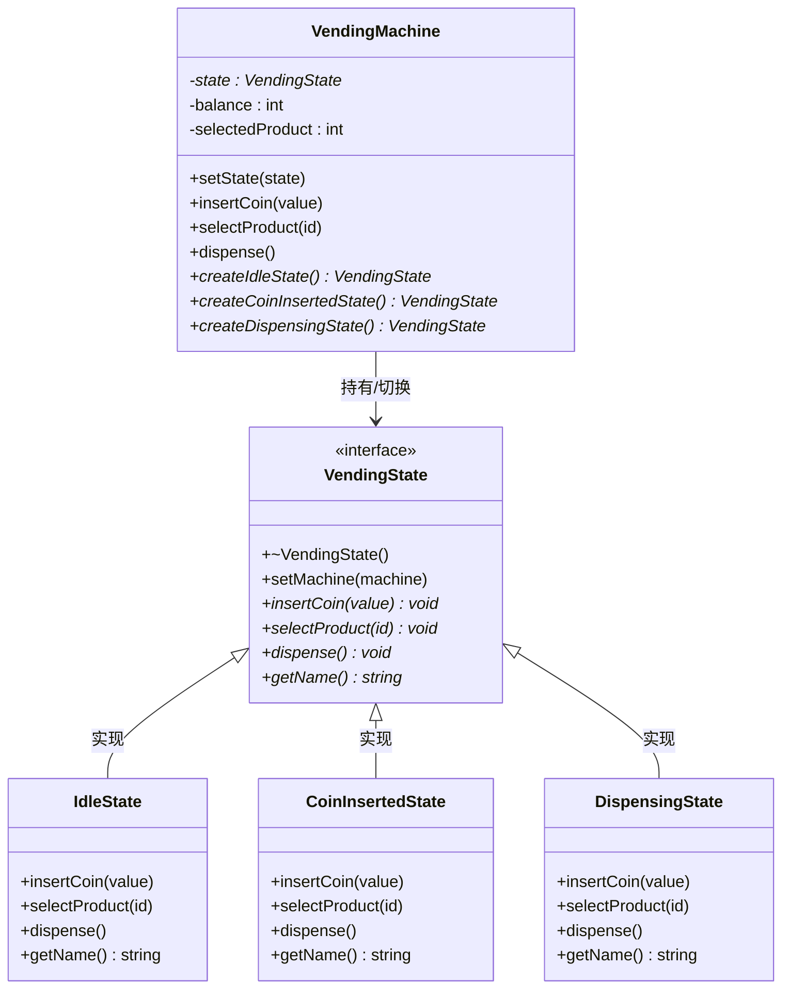
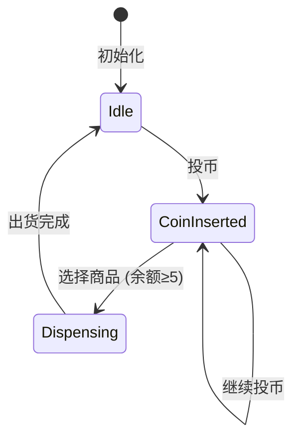

# 06. 状态机模式 - 类图详解

## 类图



---

## 字段详解

### VendingMachine（售货机 - 上下文）

| 字段/方法 | 类型 | 说明 |
|-----------|------|------|
| `-state` | `VendingState*` | **当前状态指针**，指向当前状态对象（Idle/CoinInserted/Dispensing） |
| `-balance` | `int` | **当前余额**，用户投入的硬币总额（元） |
| `-selectedProduct` | `int` | **已选择的商品 ID**，用户选择的商品编号 |
| `+setState(state)` | `void` | **切换状态**，删除旧状态，设置新状态 |
| `+insertCoin(value)` | `void` | **投币**，委托给当前状态处理 |
| `+selectProduct(id)` | `void` | **选择商品**，委托给当前状态处理 |
| `+dispense()` | `void` | **出货**，委托给当前状态处理 |
| `+createIdleState()` | `VendingState*` | **工厂方法**，创建待机状态对象 |
| `+createCoinInsertedState()` | `VendingState*` | **工厂方法**，创建已投币状态对象 |
| `+createDispensingState()` | `VendingState*` | **工厂方法**，创建出货中状态对象 |

### VendingState（状态接口）

| 字段/方法 | 类型 | 说明 |
|-----------|------|------|
| `+setMachine(machine)` | `void` | **设置上下文**，让状态持有售货机指针 |
| `+insertCoin(value)` | `void` | **投币处理**，各状态实现不同逻辑 |
| `+selectProduct(id)` | `void` | **选择商品处理**，各状态实现不同逻辑 |
| `+dispense()` | `void` | **出货处理**，各状态实现不同逻辑 |
| `+getName()` | `string` | **状态名称**，用于调试显示 |

### IdleState（待机状态）

| 方法 | 行为 |
|------|------|
| `insertCoin(value)` | 接收投币，增加余额，**切换到 CoinInsertedState** |
| `selectProduct(id)` | 提示"请先投币" |
| `dispense()` | 提示"无效操作" |

### CoinInsertedState（已投币状态）

| 方法 | 行为 |
|------|------|
| `insertCoin(value)` | 继续接收投币，累加余额 |
| `selectProduct(id)` | 检查余额，如果≥5 元则扣款并**切换到 DispensingState** |
| `dispense()` | 提示"请选择商品" |

### DispensingState（出货中状态）

| 方法 | 行为 |
|------|------|
| `insertCoin(value)` | 提示"请勿投币" |
| `selectProduct(id)` | 提示"请稍候" |
| `dispense()` | 出货，找零，**切换回 IdleState** |

---

## 状态转换图



---

## 代码示例

```cpp
// 创建售货机
VendingMachine machine;
machine.setState(machine.createIdleState());  // 初始状态：待机

// 场景 1：投币
machine.insertCoin(5);  // 投入 5 元
// 状态转换：IdleState → CoinInsertedState

// 场景 2：选择商品
machine.selectProduct(1);  // 选择商品 ID=1
// 状态转换：CoinInsertedState → DispensingState

// 场景 3：出货
machine.dispense();  // 出货
// 状态转换：DispensingState → IdleState
```

---

## 查看方法

1. 安装插件：**Markdown Preview Mermaid Support**
2. 打开本文件
3. 按 `Ctrl+Shift+V` 预览
