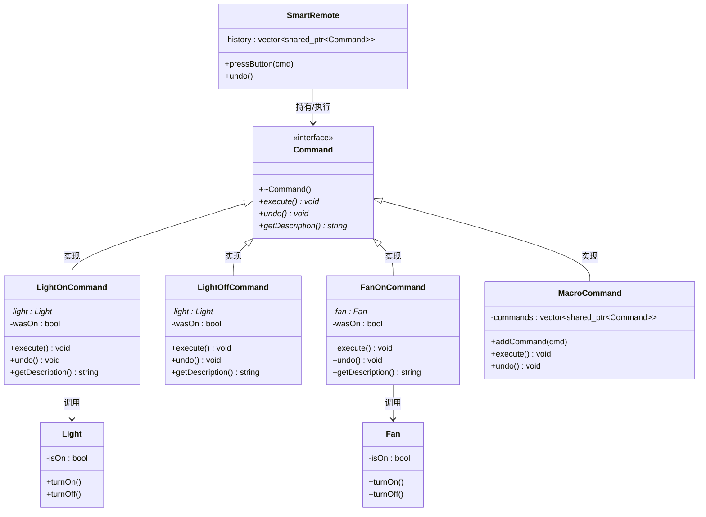

# 07. 命令模式 - 类图详解

## 类图



---

## 字段详解

### Command（命令 - 接口）

| 字段/方法 | 类型 | 说明 |
|-----------|------|------|
| `+~Command()` | 虚析构 | **虚析构函数** |
| `+execute()*` | `void` | **执行命令**，执行具体操作 |
| `+undo()*` | `void` | **撤销命令**，恢复到执行前状态 |
| `+getDescription()*` | `string` | **获取描述**，返回命令名称 |

### LightOnCommand（开灯命令 - 具体命令）

| 字段/方法 | 类型 | 说明 |
|-----------|------|------|
| `-light` | `Light*` | **接收者指针**，要操作的灯光对象 |
| `-wasOn` | `bool` | **执行前状态**，记录执行前灯是否亮着（用于撤销） |
| `+execute()` | `void` | 记录当前状态，然后开灯 |
| `+undo()` | `void` | 如果执行前是关的，则关灯 |
| `+getDescription()` | `string` | 返回 "开灯" |

### LightOffCommand（关灯命令 - 具体命令）

| 字段/方法 | 类型 | 说明 |
|-----------|------|------|
| `-light` | `Light*` | **接收者指针** |
| `-wasOn` | `bool` | **执行前状态**，记录执行前灯是否亮着 |
| `+execute()` | `void` | 记录当前状态，然后关灯 |
| `+undo()` | `void` | 如果执行前是开的，则开灯 |
| `+getDescription()` | `string` | 返回 "关灯" |

### FanOnCommand（开风扇命令 - 具体命令）

| 字段/方法 | 类型 | 说明 |
|-----------|------|------|
| `-fan` | `Fan*` | **接收者指针**，要操作的风扇对象 |
| `-wasOn` | `bool` | **执行前状态** |
| `+execute()` | `void` | 记录状态，然后开风扇 |
| `+undo()` | `void` | 如果执行前是关的，则关风扇 |
| `+getDescription()` | `string` | 返回 "开风扇" |

### MacroCommand（宏命令 - 组合命令）

| 字段/方法 | 类型 | 说明 |
|-----------|------|------|
| `-commands` | `vector~shared_ptr~Command~~` | **命令列表**，存储多个命令对象 |
| `+addCommand(cmd)` | `void` | **添加命令**，将命令加入列表 |
| `+execute()` | `void` | **遍历执行**所有命令 |
| `+undo()` | `void` | **反向撤销**，从后往前撤销所有命令 |

### SmartRemote（智能遥控器 - 调用者）

| 字段/方法 | 类型 | 说明 |
|-----------|------|------|
| `-history` | `vector~shared_ptr~Command~~` | **命令历史**，记录执行过的命令 |
| `+pressButton(cmd)` | `void` | **按下按钮**，执行命令并记录历史 |
| `+undo()` | `void` | **撤销**，撤销上一个执行的命令 |

### Light（灯光 - 接收者）

| 字段/方法 | 类型 | 说明 |
|-----------|------|------|
| `-isOn` | `bool` | **开关状态**，true 表示亮着 |
| `+turnOn()` | `void` | 开灯 |
| `+turnOff()` | `void` | 关灯 |

### Fan（风扇 - 接收者）

| 字段/方法 | 类型 | 说明 |
|-----------|------|------|
| `-isOn` | `bool` | **开关状态** |
| `+turnOn()` | `void` | 开风扇 |
| `+turnOff()` | `void` | 关风扇 |

---

## 命令模式核心

```
1. 命令接口：Command（定义 execute/undo）
2. 具体命令：LightOnCommand 等（封装操作和接收者）
3. 接收者：Light/Fan（执行实际工作）
4. 调用者：SmartRemote（触发命令，记录历史）
```

---

## 代码示例

```cpp
// 创建接收者
auto light = make_shared<Light>();
auto fan = make_shared<Fan>();

// 创建命令
auto lightOn = make_shared<LightOnCommand>(light.get());
auto fanOn = make_shared<FanOnCommand>(fan.get());

// 创建遥控器
SmartRemote remote;

// 执行命令
remote.pressButton(lightOn);  // 开灯
remote.pressButton(fanOn);    // 开风扇

// 撤销命令
remote.undo();  // 关风扇
remote.undo();  // 关灯
```

---

## 查看方法

1. 安装插件：**Markdown Preview Mermaid Support**
2. 按 `Ctrl+Shift+V` 预览
