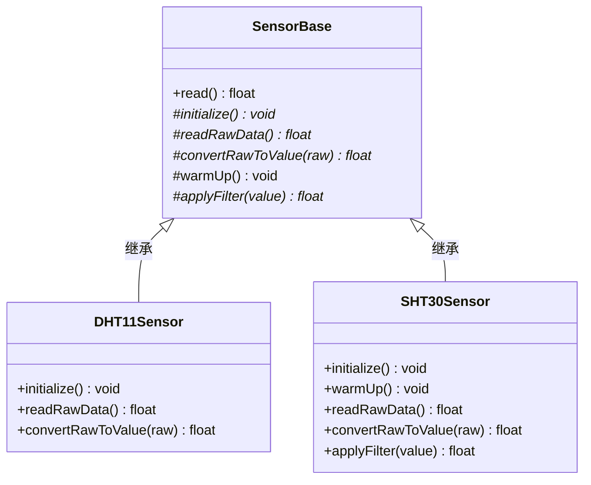

# 08. 模板方法模式 - 类图详解

## 类图



---

## 字段详解

### SensorBase（传感器基类 - 抽象类）

| 字段/方法 | 类型 | 说明 |
|-----------|------|------|
| `+read()` | `float` | **模板方法**，定义数据采集的标准流程（final，子类不能重写） |
| `#initialize()*` | `void` | **纯虚方法**，初始化传感器，子类必须实现 |
| `#readRawData()*` | `float` | **纯虚方法**，读取原始数据，子类必须实现 |
| `#convertRawToValue(raw)*` | `float` | **纯虚方法**，将原始数据转换为实际值，子类必须实现 |
| `#warmUp()` | `void` | **钩子方法**，预热操作，默认空实现，子类可选重写 |
| `#applyFilter(value)*` | `float` | **钩子方法**，滤波操作，默认返回原值，子类可选重写 |

### DHT11Sensor（DHT11 传感器 - 具体类）

| 字段/方法 | 类型 | 说明 |
|-----------|------|------|
| `+initialize()` | `void` | 初始化单总线 GPIO，发送启动信号 |
| `+readRawData()` | `float` | 读取 40bit 原始数据 |
| `+convertRawToValue(raw)` | `float` | 转换公式：温度 = 原始值 / 10 |

### SHT30Sensor（SHT30 传感器 - 具体类）

| 字段/方法 | 类型 | 说明 |
|-----------|------|------|
| `+initialize()` | `void` | 初始化 I2C 总线，检测设备地址 0x44 |
| `+warmUp()` | `void` | **重写钩子**，预热 100ms（SHT30 需要预热） |
| `+readRawData()` | `float` | I2C 读取 6 字节原始数据 |
| `+convertRawToValue(raw)` | `float` | 转换公式：-45 + 175 × raw / 65535 |
| `+applyFilter(value)` | `float` | **重写钩子**，滑动平均滤波（3 次采样） |

---

## 模板方法模式核心

```
流程骨架（read 方法）：
1. initialize()      - 必须实现
2. warmUp()          - 可选实现（钩子）
3. readRawData()     - 必须实现
4. convertRawToValue() - 必须实现
5. applyFilter()     - 可选实现（钩子）
6. 输出结果
```

---

## 代码示例

```cpp
// 创建传感器
DHT11Sensor dht11;
SHT30Sensor sht30;

// DHT11 采集流程
dht11.read();
// 执行步骤：
// 1. initialize() - 初始化单总线
// 2. warmUp() - 跳过（DHT11 不需要）
// 3. readRawData() - 读取 40bit 数据
// 4. convertRawToValue() - 除以 10
// 5. applyFilter() - 跳过（DHT11 不滤波）

// SHT30 采集流程
sht30.read();
// 执行步骤：
// 1. initialize() - 初始化 I2C
// 2. warmUp() - 预热 100ms ✓
// 3. readRawData() - I2C 读取
// 4. convertRawToValue() - 公式转换
// 5. applyFilter() - 滑动平均滤波 ✓
```

---

## 查看方法

1. 安装插件：**Markdown Preview Mermaid Support**
2. 按 `Ctrl+Shift+V` 预览
