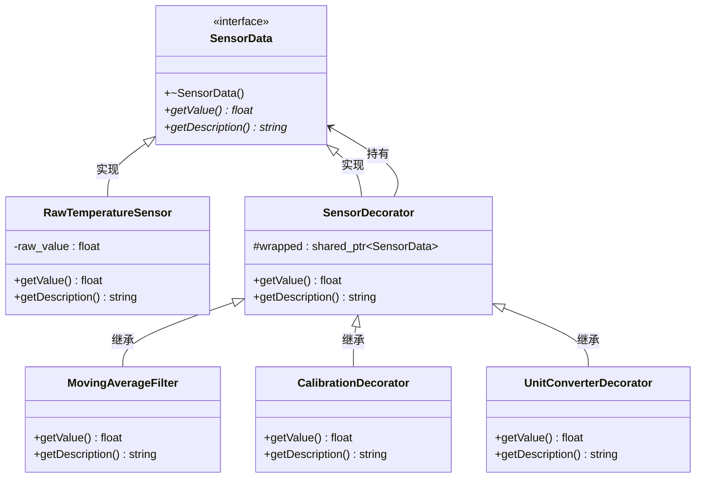

# 09. 装饰器模式 - 类图详解

## 类图



---

## 字段详解

### SensorData（传感器数据 - 组件接口）

| 字段/方法 | 类型 | 说明 |
|-----------|------|------|
| `+~SensorData()` | 虚析构 | **虚析构函数** |
| `+getValue()*` | `float` | **获取数值**，返回传感器测量值 |
| `+getDescription()*` | `string` | **获取描述**，返回数据处理链的描述 |

### RawTemperatureSensor（原始传感器 - 具体组件）

| 字段/方法 | 类型 | 说明 |
|-----------|------|------|
| `-raw_value` | `float` | **原始值**，传感器的原始测量值（如 25.0） |
| `+getValue()` | `float` | 返回原始值 |
| `+getDescription()` | `string` | 返回 "原始传感器" |

### SensorDecorator（传感器装饰器 - 装饰器基类）

| 字段/方法 | 类型 | 说明 |
|-----------|------|------|
| `#wrapped` | `shared_ptr~SensorData~` | **被装饰对象**，持有组件或上一层装饰器 |
| `+getValue()` | `float` | **默认委托**，返回 `wrapped->getValue()` |
| `+getDescription()` | `string` | **默认委托**，返回 `wrapped->getDescription()` |

### MovingAverageFilter（滑动平均滤波 - 具体装饰器）

| 字段/方法 | 类型 | 说明 |
|-----------|------|------|
| `+getValue()` | `float` | **添加滤波功能**，计算最近 3 次的平均值 |
| `+getDescription()` | `string` | 返回 "原始传感器 + [滑动平均滤波]" |

### CalibrationDecorator（校准装饰器 - 具体装饰器）

| 字段/方法 | 类型 | 说明 |
|-----------|------|------|
| `+getValue()` | `float` | **添加校准功能**，应用公式：(raw + offset) × scale |
| `+getDescription()` | `string` | 返回 "... + [校准]" |

### UnitConverterDecorator（单位转换装饰器 - 具体装饰器）

| 字段/方法 | 类型 | 说明 |
|-----------|------|------|
| `+getValue()` | `float` | **添加转换功能**，摄氏转华氏：C × 9/5 + 32 |
| `+getDescription()` | `string` | 返回 "... + [°C→°F]" |

---

## 装饰器模式核心

```
装饰器链示例：
RawTemperatureSensor(25.0)
    ↓ wrapped by
MovingAverageFilter → 滤波后：25.0
    ↓ wrapped by
CalibrationDecorator → 校准后：(25.0 - 0.5) × 1.02 = 24.99
    ↓ wrapped by
UnitConverterDecorator → 转换后：24.99 × 9/5 + 32 = 76.98°F
```

---

## 代码示例

```cpp
// 创建核心对象
auto raw = make_shared<RawTemperatureSensor>(25.0f);

// 添加滤波
auto filtered = make_shared<MovingAverageFilter>(raw);

// 添加校准
auto calibrated = make_shared<CalibrationDecorator>(filtered, -0.5f, 1.02f);

// 添加单位转换
auto converted = make_shared<UnitConverterDecorator>(calibrated);

// 获取最终值
float value = converted->getValue();  // 76.98°F
```

---

## 查看方法

1. 安装插件：**Markdown Preview Mermaid Support**
2. 按 `Ctrl+Shift+V` 预览
