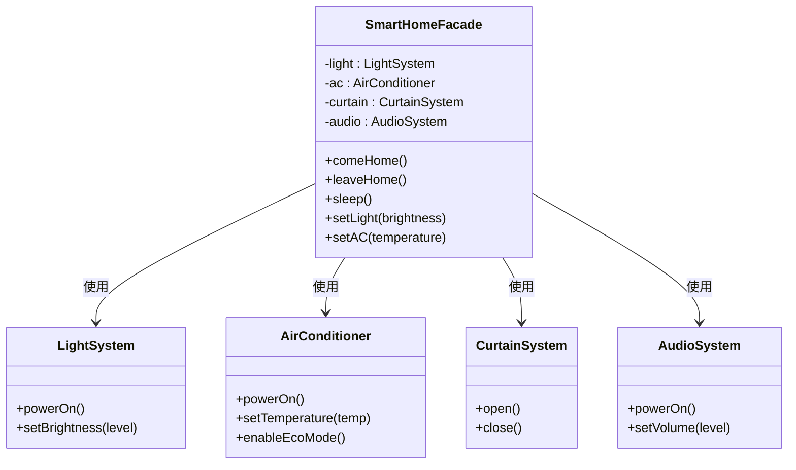

# 10. 外观模式 - 类图详解

## 类图



---

## 字段详解

### SmartHomeFacade（智能家居外观 - 外观类）

| 字段/方法 | 类型 | 说明 |
|-----------|------|------|
| `-light` | `LightSystem` | **灯光子系统**，持有灯光对象 |
| `-ac` | `AirConditioner` | **空调子系统**，持有空调对象 |
| `-curtain` | `CurtainSystem` | **窗帘子系统**，持有窗帘对象 |
| `-audio` | `AudioSystem` | **音响子系统**，持有音响对象 |
| `+comeHome()` | `void` | **回家模式**，一键执行：开窗帘→开灯→开空调→开音响 |
| `+leaveHome()` | `void` | **离家模式**，一键执行：关闭所有设备 |
| `+sleep()` | `void` | **睡眠模式**，一键执行：关窗帘→关灯→空调节能 |
| `+setLight(brightness)` | `void` | **简化控制**，设置灯光亮度 |
| `+setAC(temperature)` | `void` | **简化控制**，设置空调温度 |

### LightSystem（灯光系统 - 子系统）

| 字段/方法 | 类型 | 说明 |
|-----------|------|------|
| `+powerOn()` | `void` | 打开灯光电源 |
| `+setBrightness(level)` | `void` | 设置亮度（0-100%） |

### AirConditioner（空调系统 - 子系统）

| 字段/方法 | 类型 | 说明 |
|-----------|------|------|
| `+powerOn()` | `void` | 打开压缩机 |
| `+setTemperature(temp)` | `void` | 设置目标温度（°C） |
| `+enableEcoMode()` | `void` | 启用节能模式 |

### CurtainSystem（窗帘系统 - 子系统）

| 字段/方法 | 类型 | 说明 |
|-----------|------|------|
| `+open()` | `void` | 打开窗帘 |
| `+close()` | `void` | 关闭窗帘 |

### AudioSystem（音响系统 - 子系统）

| 字段/方法 | 类型 | 说明 |
|-----------|------|------|
| `+powerOn()` | `void` | 打开功放 |
| `+setVolume(level)` | `void` | 设置音量（0-100） |

---

## 外观模式核心

```
1. 外观类：SmartHomeFacade（提供简化接口）
2. 子系统：Light/Audio/AC/Curtain（实现具体功能）
3. 客户端：只和外观交互，不知道子系统存在
4. 场景模式：comeHome/leaveHome/sleep 等一键操作
```

---

## 代码示例

```cpp
// 创建外观
SmartHomeFacade smartHome;

// 场景 1：回家模式（一键执行多个操作）
smartHome.comeHome();
// 内部执行：
// 1. curtain.open()
// 2. light.powerOn() + light.setBrightness(80)
// 3. ac.powerOn() + ac.setTemperature(26) + ac.setFanSpeed(2)
// 4. audio.powerOn() + audio.setVolume(30)

// 场景 2：简化控制
smartHome.setLight(50);  // 设置灯光 50%
smartHome.setAC(24.0f);  // 设置空调 24°C
```

---

## 查看方法

1. 安装插件：**Markdown Preview Mermaid Support**
2. 按 `Ctrl+Shift+V` 预览
