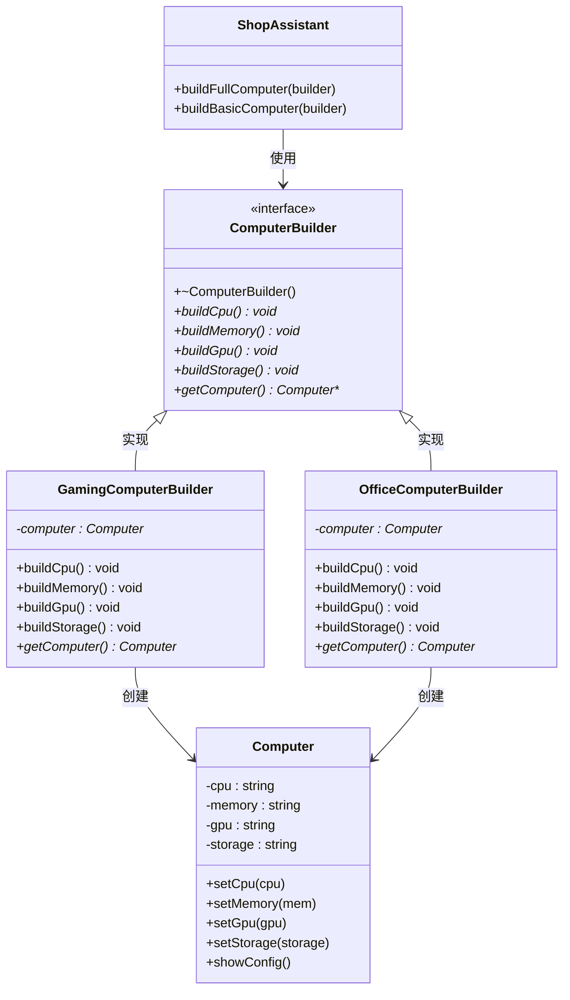

# 11. 建造者模式 - 类图详解

## 类图



---

## 字段详解

### Computer（电脑 - 产品）

| 字段/方法 | 类型 | 说明 |
|-----------|------|------|
| `-cpu` | `string` | **CPU 型号**，如 "Intel i9-13900K" |
| `-memory` | `string` | **内存规格**，如 "32GB DDR5" |
| `-gpu` | `string` | **显卡型号**，如 "NVIDIA RTX 4080" |
| `-storage` | `string` | **存储规格**，如 "2TB NVMe SSD" |
| `+setCpu(cpu)` | `void` | 设置 CPU |
| `+setMemory(mem)` | `void` | 设置内存 |
| `+setGpu(gpu)` | `void` | 设置显卡 |
| `+setStorage(storage)` | `void` | 设置存储 |
| `+showConfig()` | `void` | 显示完整配置 |

### ComputerBuilder（电脑建造者 - 建造者接口）

| 字段/方法 | 类型 | 说明 |
|-----------|------|------|
| `+~ComputerBuilder()` | 虚析构 | **虚析构函数** |
| `+buildCpu()*` | `void` | **构建 CPU**，安装 CPU |
| `+buildMemory()*` | `void` | **构建内存**，安装内存条 |
| `+buildGpu()*` | `void` | **构建显卡**，安装显卡 |
| `+buildStorage()*` | `void` | **构建存储**，安装 SSD |
| `+getComputer()*` | `Computer*` | **获取产品**，返回组装好的电脑 |

### GamingComputerBuilder（游戏电脑建造者 - 具体建造者）

| 字段/方法 | 类型 | 说明 |
|-----------|------|------|
| `-computer` | `Computer*` | **正在构建的产品**，指向当前组装的电脑 |
| `+buildCpu()` | `void` | 安装 "Intel i9-13900K" |
| `+buildMemory()` | `void` | 安装 "32GB DDR5 6000MHz" |
| `+buildGpu()` | `void` | 安装 "NVIDIA RTX 4080 16GB" |
| `+buildStorage()` | `void` | 安装 "2TB NVMe SSD" |
| `+getComputer()` | `Computer*` | 返回电脑指针，并重置为新电脑 |

### OfficeComputerBuilder（办公电脑建造者 - 具体建造者）

| 字段/方法 | 类型 | 说明 |
|-----------|------|------|
| `-computer` | `Computer*` | **正在构建的产品** |
| `+buildCpu()` | `void` | 安装 "Intel i5-13400" |
| `+buildMemory()` | `void` | 安装 "16GB DDR4 3200MHz" |
| `+buildGpu()` | `void` | 安装 "Intel UHD Graphics（集成）" |
| `+buildStorage()` | `void` | 安装 "512GB NVMe SSD" |
| `+getComputer()` | `Computer*` | 返回电脑指针 |

### ShopAssistant（店员 - 指挥者）

| 字段/方法 | 类型 | 说明 |
|-----------|------|------|
| `+buildFullComputer(builder)` | `void` | **构建完整电脑**，按顺序调用 buildCpu→buildMemory→buildGpu→buildStorage |
| `+buildBasicComputer(builder)` | `void` | **构建基础电脑**，只调用 buildCpu→buildMemory |

---

## 建造者模式核心

```
1. 产品：Computer（复杂对象）
2. 建造者接口：ComputerBuilder（定义构建步骤）
3. 具体建造者：GamingComputerBuilder/OfficeComputerBuilder
4. 指挥者：ShopAssistant（控制构建顺序，可选）
```

---

## 代码示例

```cpp
// 创建指挥者（店员）
ShopAssistant assistant;

// 场景 1：组装游戏电脑
GamingComputerBuilder gamingBuilder;
assistant.buildFullComputer(gamingBuilder);
Computer* gamingPC = gamingBuilder.getComputer();
gamingPC->showConfig();

// 场景 2：组装办公电脑
OfficeComputerBuilder officeBuilder;
assistant.buildFullComputer(officeBuilder);
Computer* officePC = officeBuilder.getComputer();
officePC->showConfig();

// 场景 3：自定义（只装 CPU 和内存）
GamingComputerBuilder customBuilder;
customBuilder.buildCpu();
customBuilder.buildMemory();
Computer* customPC = customBuilder.getComputer();
customPC->showConfig();
```

---

## 查看方法

1. 安装插件：**Markdown Preview Mermaid Support**
2. 按 `Ctrl+Shift+V` 预览
